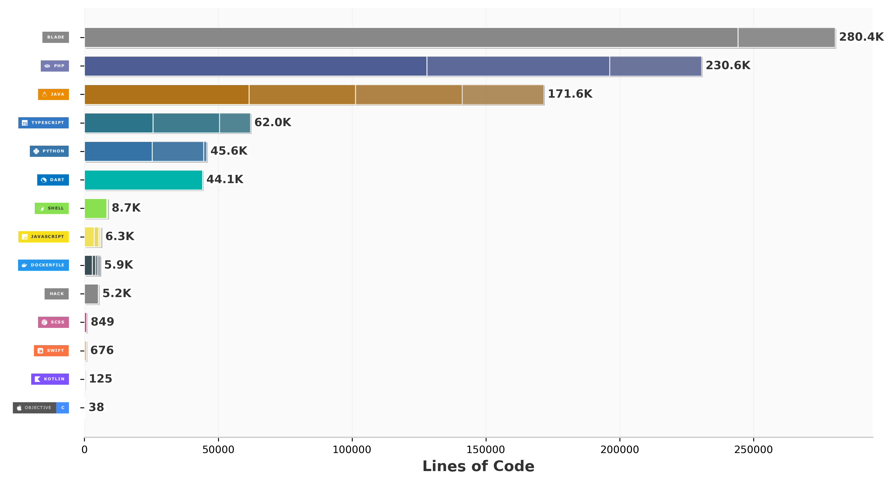

# 👋 Jules ILBOUDO | **@Aether**

> Développeur Full-Stack passionné par la création d'applications mobiles et web innovantes

## 🚀 À propos de moi

- 🔭 Je travaille actuellement sur des projets **Flutter** et **Springboot**
- 🌱 J'apprends constamment de nouvelles technologies
- 💡 Passionné par l'architecture logicielle et les bonnes pratiques

## 💻 Stack Technique

### Langages & Technologies

### Frameworks

### Outils

